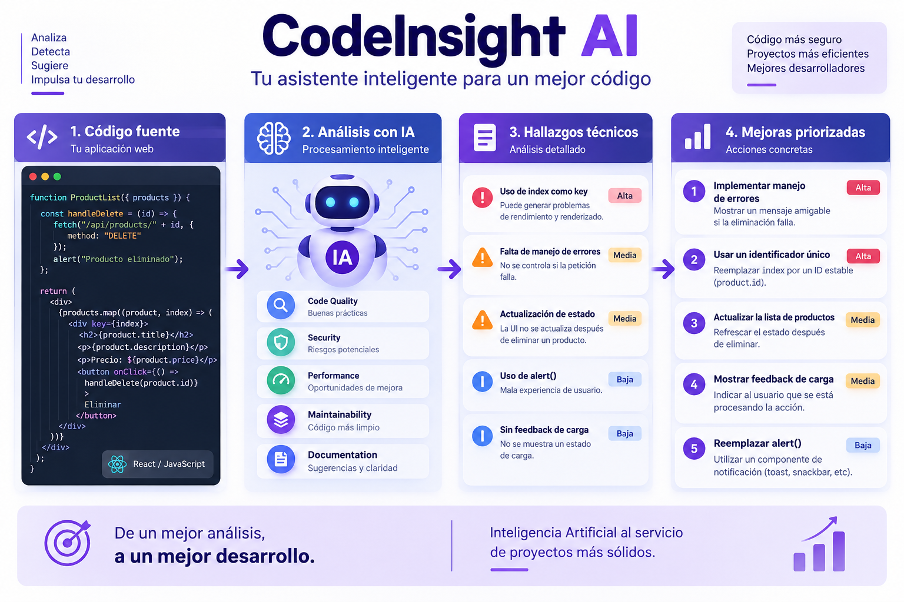

# CodeInsight AI

## Asistente inteligente para análisis y mejora de proyectos web mediante Prompt Engineering

**Proyecto Final — IA: Entretejiendo Imaginación y Algoritmos**

CodeInsight AI es una **Proof of Concept (POC)** desarrollada para demostrar cómo la Inteligencia Artificial Generativa y las técnicas de Prompt Engineering pueden utilizarse como apoyo en la revisión técnica de proyectos web.

La solución combina modelos **Texto → Texto** y **Texto → Imagen**, aplicando técnicas de Fast Prompting para analizar código, detectar posibles oportunidades de mejora, generar recomendaciones priorizadas y representar visualmente los resultados.

---

## Problemática

Durante el desarrollo de aplicaciones web pueden aparecer problemas relacionados con:

- calidad de código;
- mantenibilidad;
- manejo de errores;
- seguridad;
- rendimiento;
- experiencia de usuario;
- documentación.

Detectar estos problemas manualmente puede requerir tiempo, experiencia técnica y múltiples revisiones.

CodeInsight AI propone utilizar Inteligencia Artificial Generativa como herramienta de apoyo para realizar una primera revisión estructurada del código y obtener recomendaciones técnicas organizadas.

> La solución no busca reemplazar herramientas profesionales de testing, análisis estático o auditoría de seguridad, sino complementar el trabajo del desarrollador.

---

## Objetivo

Desarrollar una POC capaz de utilizar técnicas de Prompt Engineering para analizar fragmentos de código de una aplicación web y transformar los resultados en información técnica útil y reutilizable.

El proyecto busca demostrar especialmente cómo la optimización de prompts influye en la calidad y estructura de las respuestas generadas por un modelo de Inteligencia Artificial.

---

## Modelos utilizados

### Texto → Texto

Se utiliza la **API de Groq** junto con el modelo:

```text
openai/gpt-oss-20b
```

El modelo se utiliza para:

- analizar código;
- detectar problemas técnicos;
- realizar una revisión específica de seguridad;
- generar recomendaciones;
- crear un reporte técnico;
- producir un backlog de mejoras.

### Texto → Imagen

Se utiliza **ChatGPT - Generación de imágenes** como herramienta externa.

Según lo permitido por la consigna del proyecto, la imagen se genera directamente desde la herramienta, sin utilizar una API de generación de imágenes.

El prompt utilizado se encuentra documentado en:

```text
prompts/prompt_texto_imagen.md
```

---

## Resultado Texto → Imagen

La imagen representa visualmente el flujo principal de CodeInsight AI:

**Código fuente → Análisis con IA → Hallazgos técnicos → Mejoras priorizadas**



---

## Técnicas de Fast Prompting

Durante el proyecto se implementan diferentes técnicas de Prompt Engineering.

### Role Prompting

Se asigna al modelo un rol específico para orientar la respuesta hacia un dominio determinado.

Ejemplo:

```text
Actúa como un desarrollador web senior especializado en React,
revisión de código y buenas prácticas de desarrollo frontend.
```

### Context Prompting

Se proporciona información adicional sobre el proyecto y el código analizado.

### Task Specification

Se especifica claramente la tarea que debe realizar el modelo.

### Constraints

Se establecen restricciones para controlar la respuesta, por ejemplo:

- cantidad máxima de hallazgos;
- prioridades;
- evitar recomendaciones genéricas;
- no inventar vulnerabilidades;
- no asumir información que no aparece en el código.

### Output Formatting

Se establece previamente la estructura esperada de la respuesta.

### Few-Shot Prompting

Se incorpora un ejemplo del formato esperado para orientar al modelo.

### Prompt Chaining

La tarea se divide en diferentes etapas relacionadas:

```text
Análisis técnico
      ↓
Análisis de seguridad
      ↓
Reporte técnico
      ↓
Backlog de mejoras
```

---

## Comparación de prompts

Uno de los objetivos principales de la POC es comparar dos enfoques.

### Prompt básico

```text
Analiza el siguiente código y dime qué problemas tiene.
```

Este prompt permite obtener una respuesta inicial, pero ofrece poco control sobre:

- estructura;
- cantidad de hallazgos;
- prioridades;
- alcance del análisis;
- posibles inferencias del modelo.

### Prompt optimizado

La versión optimizada incorpora:

```text
Rol
+
Contexto
+
Tarea
+
Restricciones
+
Formato de salida
+
Ejemplo Few-Shot
```

Esto permite obtener respuestas más estructuradas, consistentes y reutilizables.

Los prompts utilizados se encuentran documentados en:

```text
prompts/prompt_texto_texto.md
```

---

## Prompt Chaining

CodeInsight AI divide el proceso en diferentes etapas.

### 1. Análisis técnico

Identificación de problemas relacionados con buenas prácticas, mantenibilidad, manejo de errores y experiencia de usuario.

### 2. Análisis de seguridad

Revisión orientada a posibles riesgos que puedan justificarse mediante el código disponible.

### 3. Reporte técnico

Consolidación de los resultados obtenidos anteriormente.

### 4. Backlog de mejoras

Transformación de las recomendaciones en tareas concretas y priorizadas.

---

## Visualización de resultados

Los resultados generados por el modelo son procesados mediante:

- **Pandas**
- **Matplotlib**

La Notebook genera tablas y gráficos que permiten visualizar la distribución de prioridades:

```text
Alta
Media
Baja
```

Estas visualizaciones complementan el análisis textual realizado por la IA.

---

## Tecnologías utilizadas

- Python
- Jupyter Notebook
- Google Colab
- Groq API
- `openai/gpt-oss-20b`
- Pandas
- Matplotlib
- HTTPX
- ChatGPT
- Git
- GitHub

---

## Estructura del proyecto

```text
ENTREGA2-Gen de prompt/
│
├── images/
│   ├── capturas/
│   └── texto-imagen/
│       └── codeinsight_analisis_visual.png
│
├── prompts/
│   ├── prompt_texto_texto.md
│   └── prompt_texto_imagen.md
│
├── .gitignore
├── CodeInsight_AI_Entrega2.ipynb
├── CodeInsight_AI_Proyecto_Final.ipynb
├── README.md
└── requirements.txt
```

### Notebooks

`CodeInsight_AI_Entrega2.ipynb`

Corresponde a la segunda entrega del proyecto y se conserva para mostrar la evolución del trabajo.

`CodeInsight_AI_Proyecto_Final.ipynb`

Contiene la implementación completa del Proyecto Final.

---

## Instalación

### 1. Clonar el repositorio

```bash
git clone https://github.com/IvannaAr94/ENTREGA-FINAL-CodeInsight-IA-gen-dePrompt.git
```

### 2. Ingresar al proyecto

```bash
cd ENTREGA2-CodeInsight-IA-gen-dePrompt
```

### 3. Instalar las dependencias

```bash
python -m pip install -r requirements.txt
```

Las principales dependencias son:

```text
groq
pandas
matplotlib
httpx
ipykernel
```

---

## Configuración de Groq

Por razones de seguridad, la API Key **no se almacena dentro del código ni en GitHub**.

Durante la ejecución de la Notebook se solicita mediante:

```python
import getpass

GROQ_API_KEY = getpass.getpass(
    "Ingresá tu GROQ API Key: "
)
```

Luego se inicializa el cliente:

```python
from groq import Groq

client = Groq(api_key=GROQ_API_KEY)
```

De esta manera, la credencial permanece fuera del repositorio.

---

## Ejecución

Abrir:

```text
CodeInsight_AI_Proyecto_Final.ipynb
```

La Notebook debe ejecutarse de forma secuencial desde la primera celda de código.

Orden general:

```text
Instalación de dependencias
        ↓
Imports
        ↓
API Key
        ↓
Configuración del modelo
        ↓
Función consultar_ia()
        ↓
Código de prueba
        ↓
Prompt básico
        ↓
Prompt optimizado
        ↓
Comparación
        ↓
Prompt Chaining
        ↓
Visualizaciones
        ↓
Texto → Imagen
        ↓
Resultados y conclusiones
```

---

## Buenas prácticas de seguridad

El proyecto aplica diferentes buenas prácticas:

- las API Keys no se almacenan en el código;
- `.env` se encuentra ignorado mediante `.gitignore`;
- `.venv` no se sube al repositorio;
- no se incluyen credenciales dentro de la Notebook;
- los prompts de seguridad indican explícitamente que el modelo no debe inventar vulnerabilidades;
- los resultados generados por IA deben ser revisados antes de aplicarlos sobre un proyecto real.

---

## Resultados

La POC permite:

- analizar fragmentos de código mediante IA;
- comparar un prompt básico con un prompt optimizado;
- aplicar técnicas de Fast Prompting;
- estructurar los hallazgos;
- asignar prioridades;
- realizar una revisión de seguridad;
- generar un reporte técnico;
- producir un backlog de mejoras;
- visualizar los resultados mediante gráficos;
- generar una representación visual utilizando un modelo Texto → Imagen.

Los resultados muestran que un prompt correctamente estructurado ofrece mayor control sobre la salida generada y facilita su reutilización en etapas posteriores.

---

## Limitaciones

CodeInsight AI fue desarrollado como una Proof of Concept.

Actualmente:

- analiza fragmentos representativos y no proyectos completos;
- las respuestas pueden variar entre ejecuciones;
- depende del contexto proporcionado;
- no reemplaza herramientas profesionales de testing o seguridad;
- requiere revisión humana de las recomendaciones;
- la generación de imágenes se realiza mediante una herramienta externa.

---

## Mejoras futuras

Entre las posibles evoluciones del proyecto se encuentran:

- análisis automático de múltiples archivos;
- soporte para diferentes lenguajes y frameworks;
- generación de reportes exportables;
- integración con herramientas de análisis estático;
- interfaz gráfica;
- selección de diferentes tipos de análisis;
- integración Texto → Imagen mediante API;
- incorporación opcional de un modelo Texto → Audio.

---

## Referencias

- Documentación oficial de Python.
- Documentación oficial de Jupyter Notebook.
- Documentación oficial de Groq API.
- Documentación oficial de Pandas.
- Documentación oficial de Matplotlib.
- Documentación de Git y GitHub.
- Material proporcionado durante el curso de Inteligencia Artificial - Generación de Prompts.
- ChatGPT, utilizado para generación Texto → Imagen.

---

## Autora

### Ivanna Micaela Arzamendia

Proyecto desarrollado como entrega final de la materia **Inteligencia Artificial - Generación de Prompts**.
